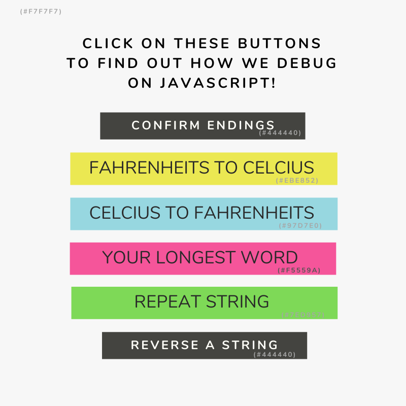

# Development Strategy

> **Debugging Project Week 1**

There is nothing special about the design from this project because we are focusing on the javascript. However to see the connection among HTML, CSS and Javascript, it is necessary to create at least a way on the structure, such as HTML elements, to ensure the JavaScript code can be run through, and here we use `button` for that. 

---

## Wireframe

## 0.Set-Up

_A User can see my initial repository and live demo_

> Assigned to Yana

### Repo : Master Branch

1. Generate an new repo from [this template](https://github.com/HackYourFutureBelgium/debugging-project-week-1)
1. Clone the repo
1. Write initial, basic README
1. Write `development-strategy.md`
1. Add a wireframe
1. Push the change to Github
1. Turn on GitHub Pages

---

## 1. User story: Landing on the page

_As a site visitor, I want to know what website I am seeing_

> Assigned to Yana

### Branch(es)

1. Create an issue related to this user story on Github and assign self
1. Add a branch named `introduction`
1. Validate the code for this work
4. Push the changes
4. Pull request and merge it on Github

### HTML

1. Put up the website title on head and other meta families (including relating all the script links)
1. Create `page title` and `button` as many as needed (6 buttons)

### CSS

- Nothing to be done at this stage

### JavaScript

- Nothing to be done at this stage

---

## 2. User story: Button 1

_As a site visitor, I can click on the button no 1, I can interact with it and it functions well_

> Assigned to : Miroslav

### Branch(es)

1. Create an issue related to this user story on Github and assign self
1. Add a brach named `button-confirm`
1. Validate the code for this work
4. Push the changes from this branch when it is done
4. Pull request and merge it on Github

### HTML

- Nothing to be done at this stage

### CSS

- Nothing to be done at this stage

### JavaScript
1. Analyse, detect the errors or missing parts
2. Complete the codes
3. Do self-test

---

## 3. User story: Button 2

_As a site visitor, I can click on the button no 2, I can interact with it and it functions well_

> Assigned to : Miroslav

### Branch(es)

1. Create an issue related to this user story on Github and assign self
1. Add a brach named `button-fah-to-cel`
1. Validate the code for this work
4. Push the changes from this branch when it is done
4. Pull request and merge it on Github

### HTML

- Nothing to be done at this stage

### CSS

- Nothing to be done at this stage

### JavaScript
1. Analyse, detect the errors or missing parts
2. Complete the codes
3. Do self-test

---

## 4.  User story: Button 3

_As a site visitor, I can click on the button no 3, I can interact with it and it functions well_

> Assigned to : Yana

### Branch(es)

1. Create an issue related to this user story on Github and assign self
1. Add a brach named `button-cel-to-fah`
1. Validate the code for this work
4. Push the changes from this branch when it is done
4. Pull request and merge it on Github

### HTML

- Nothing to be done at this stage

### CSS

- Nothing to be done at this stage

### JavaScript
1. Analyse, detect the errors or missing parts
2. Complete the codes
3. Do self-test

---

## 5.  User story: Button 4

_As a site visitor, I can click on the button no 4, I can interact with it and it functions well_

> Assigned to : Yana

### Branch(es)

1. Create an issue related to this user story on Github and assign self
1. Add a brach named `button-longest-word`
1. Validate the code for this work
4. Push the changes from this branch when it is done
4. Pull request and merge it on Github

### HTML

- Nothing to be done at this stage

### CSS

- Nothing to be done at this stage

### JavaScript
1. Analyse, detect the errors or missing parts
2. Complete the codes
3. Do self-test

---

## 6.  User story: Button 5

_As a site visitor, I can click on the button no 5, I can interact with it and it functions well_

> Assigned to : Harun

### Branch(es)

1. Create an issue related to this user story on Github and assign self
1. Add a brach named `button-repeat-string`
1. Validate the code for this work
4. Push the changes from this branch when it is done
4. Pull request and merge it on Github

### HTML

- Nothing to be done at this stage

### CSS

- Nothing to be done at this stage

### JavaScript
1. Analyse, detect the errors or missing parts
2. Complete the codes
3. Do self-test

---

## 7.  User story: Button 6

_As a site visitor, I can click on the button no 6, I can interact with it and it functions well_

> Assigned to : Harun

### Branch(es)

1. Create an issue related to this user story on Github and assign self
1. Add a brach named `button-reserve-string`
1. Validate the code for this work
4. Push the changes from this branch when it is done
4. Pull request and merge it on Github

### HTML

- Nothing to be done at this stage

### CSS

- Nothing to be done at this stage

### JavaScript
1. Analyse, detect the errors or missing parts
2. Complete the codes
3. Do self-test

---

## 8.  User story: CSS treatment 

_As a site visitor, I can click on all the buttons and the site looks nice_

> Assigned to : Miroslav

### Branch(es)

1. Create an issue related to this user story on Github and assign self.
1. Add a brach named `beautification`
1. Validate the code for this work.
4. Push the changes from this branch when it is done
4. Pull request and merge it on Github

### HTML

- Changes are allowed if needed

### CSS

- Add colors on the buttons
- Position them on the right position as on the wireframe
- Turn it into a responsive site, if needed

### JavaScript

- Nothing to be done at this stage

---

## Finishing Touches

_As a developer we want everything to be right_

> Assigned to : Harun

### Master Repo

1. No branch needed, no issues needed
1. Validate the code for the last time, for any last mistakes, **fix it**
1. Make sure all works properly
1. Write final, complete README and last touch on `development-strategy.md`, if still needed
1. DONE